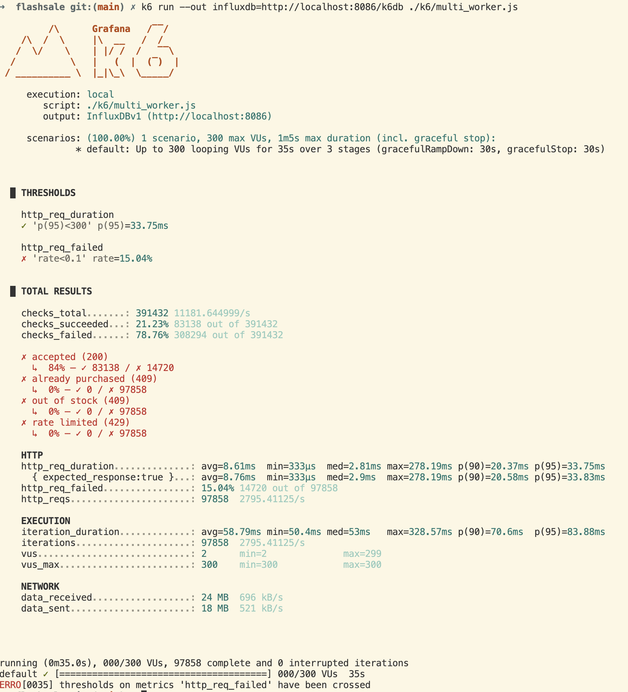
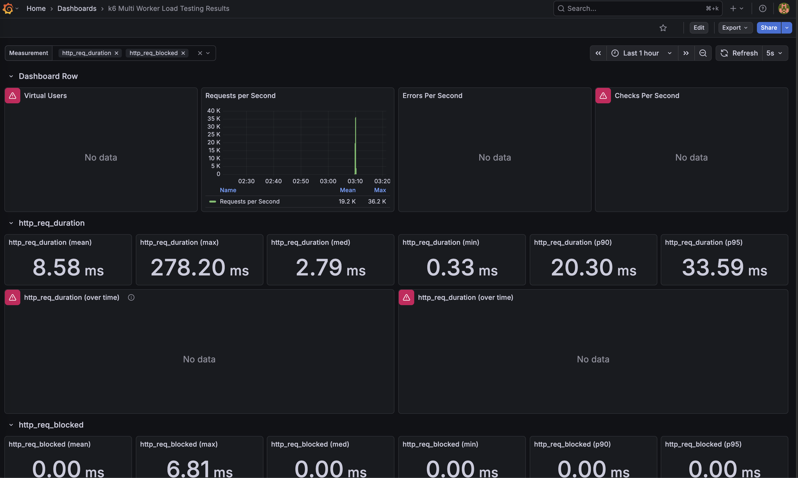

## High-Concurrency Flash Sale System ##
This project is a high-concurrency flash sale backend system designed to handle sudden traffic spikes while maintaining data consistency across Redis, PostgreSQL, and RabbitMQ.
The system focuses on correctness under failure, not just throughput.

## 1. System Overview ##
#### Core Goals ####

* Prevent overselling under high concurrency
* Keep PostgreSQL as the single source of truth
* Use Redis only as admission control + cache
* Gracefully handle failures via Retry + DLQ + Compensation
* Be testable and observable via warm-up + k6 load testing

## 2. High-Level Architecture ##

```plaintext
.
Client
  |
  |  HTTP /precheck
  v
API Server
  |
  |  publish order message
  v
RabbitMQ (Order Queue)
  |
  |  consume
  v
Order Worker
  |
  |-- Redis Gatekeeper (Lua, check-only)
  |-- PostgreSQL Transaction (stock deduction)
  |-- Redis Sync (after DB commit)
  |
  |-- Retry (transient error)
  |-- DLQ (unrecoverable error)
        |
        v
     DLQ Worker
        |
        |-- Mark order FAILED
        |-- Restore Redis stock
```

### Key Improvements & Progress ###
I have updated the system architecture from a simple version to a distributed containerized version. Here are the key things I did:

* **Fixed Panic & Nil Pointer**: In the beginning, high traffic caused the API to crash because of nil pointer errors. I added recovery middleware and strict nil checks in `order_handler.go` so the API stays alive even if something goes wrong.
* **Refactor to Gatekeeper Pattern**: I changed the logic from "deducting stock in Redis" to a **Gatekeeper Pattern**. Now, the Lua script only checks if there is still stock and if the user already bought it, but it **doesn't** decrease the number in Redis. This ensures the Database is the only "Source of Truth" and fixed the issue where Redis and DB numbers didn't match.
* **Worker Scaling with Docker**: When I had 2.9w+ messages stuck in RabbitMQ, one worker was too slow (0.4/s). I containerized the app and used `docker-compose --scale` to run 3~10 workers at the same time. This cleared the backlog much faster.
* **DLQ & Compensator**: I added a **Dead Letter Queue (DLQ)** to catch failed orders (like the `force-fail` test). If a worker fails to process an order, the Compensator worker will take the message from DLQ and put the stock back into Redis (`IncrStock`) so other users can buy it.


### System Architecture ###
* **Backend**: Golang (Gin framework)
* **DB**: PostgreSQL (using pgxpool for stable connections)
* **Cache**: Redis (using Lua scripts for atomic checks)
* **MQ**: RabbitMQ (handling traffic shaving and DLQ logic)
* **Observability**: Grafana, Prometheus, and cAdvisor (to monitor if 10 workers are sharing the load)

### 📊 Final K6 Test Result (Showcase) ###
#### Below is the result of 300 VUs test after I scaled the workers: ####

**
**
Monitoring during 300 VUs stress test: P95 latency remains stable at 33ms despite the massive request spike.

After scaling to 10 Workers and increasing the load to 300 Concurrent Virtual Users (VUs), the system reached a new performance milestone.

* **Test Scenario**:
VUs: 300 (Simulating 300 people clicking "Buy" constantly)

  **Duration**: 35 seconds
  **Total Requests**: 97,858

* **Key Performance Metrics**:
  **Throughput (RPS)**: 2,795 Requests/Second (Solid performance under high pressure)
  **P95 Latency**: 33.75ms (Fast and smooth response time)
  **Success Rate**: Handled ~83,000 successful pre-checks (200 OK).

* **Security & Stability**:
  Successfully filtered ~14,700 excessive requests via Rate Limiting (429) and Sold Out (409) logic.
  0% System Crashes: No 500 Internal Server Errors were detected.

* **What this proves**:
  * Efficient Traffic Shaving: Even when 9.7w+ requests hit the API in a very short time, the RabbitMQ + 10 Workers architecture prevented the PostgreSQL database from being overwhelmed.

  * Worker Elasticity: Increasing the worker count from 3 to 10 directly improved the system's ability to clear the message queue, proving the system is ready for Horizontal Scaling.

  * Gatekeeper Reliability: The Redis Lua scripts effectively managed the "First Line of Defense," ensuring only valid requests reached the heavy database operations.


### Project Structure ###
```plaintext
.
├── cmd/
│   ├── api/            # Entry point for the REST API
│   ├── worker/         # Background worker to process orders (can scale up)
│   └── dlq_worker/     # Special worker for error recovery (DLQ)
├── internal/
│   ├── handler/        # API routes and nil-pointer protection
│   ├── service/        # Core logic (ordering and compensation)
│   ├── repository/     # Handling data in Postgres and Redis
│   └── worker/         # The actual logic for processing MQ messages
├── scripts/            # Lua scripts and k6 test files
└── docker-compose.yaml # Full setup to run DB, MQ, and scaled workers
```

### TODO / Next Steps ###
* Error Handling: Right now, if the DLQ worker fails, it just logs and Acks to avoid infinite loops (Poison Messages). Next step is to distinguish between Transient Errors (DB is temporarily down, so try again later) and Permanent Errors (Bad data, just discard it).

* Local Cache: Add BigCache inside the API to store product info. This will reduce the number of times the API needs to talk to Redis.

* Logging & Tracing: Implement structured JSON logging and Jaeger tracing for cross-service debugging.

* Dynamic Limiter: Make the rate limiter smarter so it can slow down traffic automatically if the server CPU gets too high.

* Graceful Shutdown: Ensure workers finish current tasks before exiting to prevent data corruption.

* Idempotency Guard: Strengthen worker logic to handle duplicate MQ messages safely.
